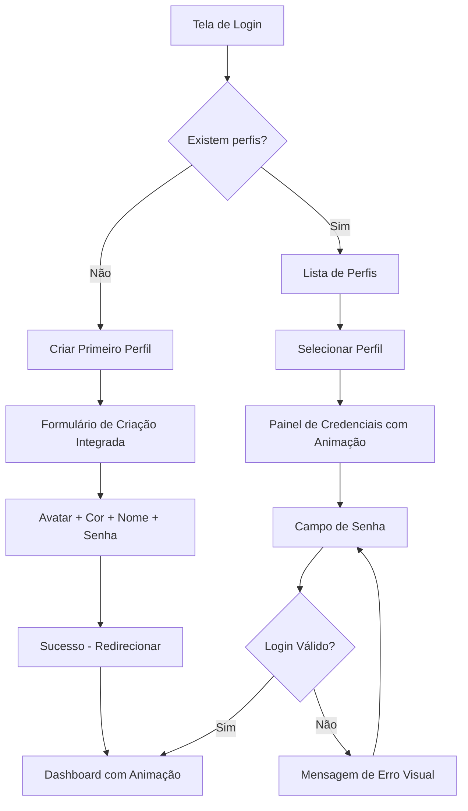
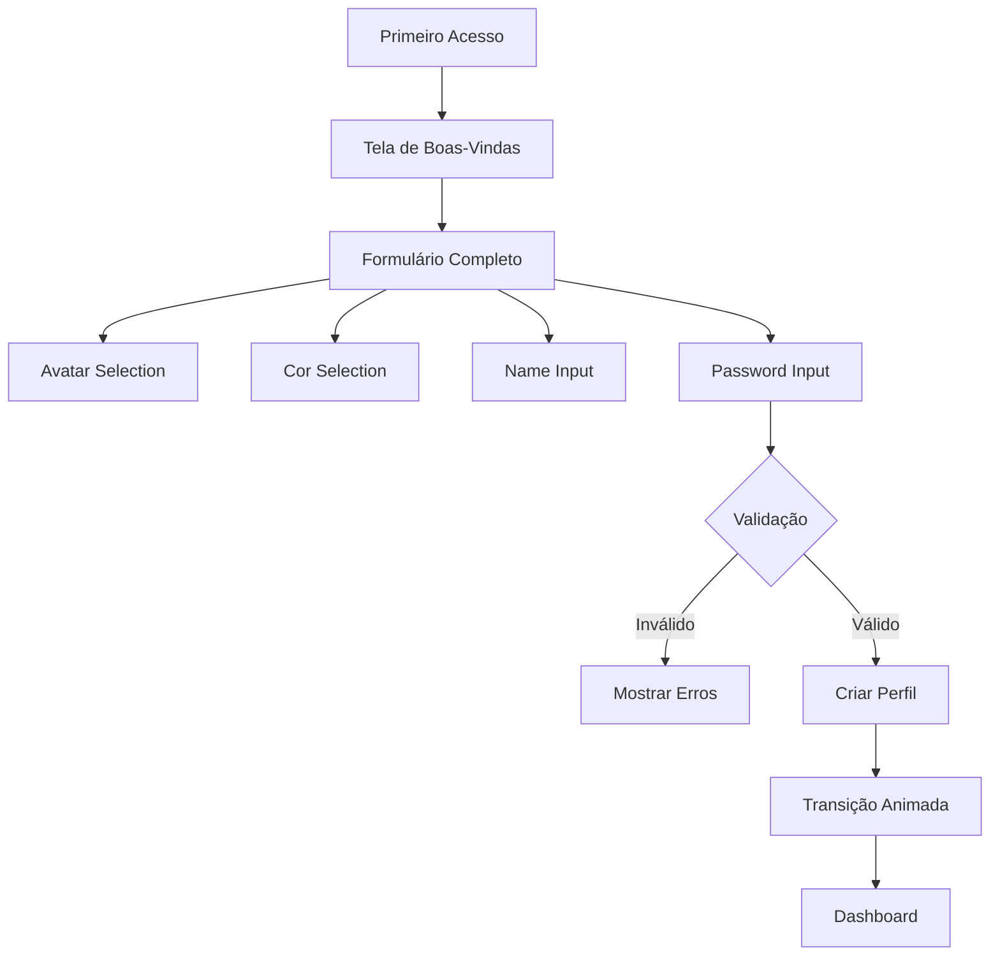

# Plano de Reestruturação da Interface de Autenticação

## Objetivo
Criar um fluxo unificado e intuitivo de autenticação onde a seleção de perfil precede e integra a inserção de senha, substituindo o uso do `prompt()` nativo por uma interface visual moderna e fluida.

---

## Análise do Estado Atual

### Problemas Identificados
1. **Login via `prompt()`** - [`ProfileSelection.tsx:71`](src/pages/ProfileSelection.tsx:71) usa `prompt()` do navegador
2. **Experiência fragmentada** - Seleção de perfil e senha são etapas desconectadas
3. **Falta de feedback visual** - Não há indicadores de erro/sucesso durante autenticação
4. **Fluxo não intuitivo** - Usuário clica no perfil e imediatamente precisa digitar senha

---

## Solução Proposta

### Arquitetura do Novo Fluxo



### Fluxo de Criação de Perfil (Primeiro Acesso)



### Componentes a Criar/Modificar

| Arquivo | Ação | Descrição |
|---------|------|-----------|
| `src/components/auth/LoginScreen.tsx` | Criar | Componente principal de login unificado |
| `src/components/auth/ProfileCard.tsx` | Criar | Card de perfil com estados (selecionado, hover) |
| `src/components/auth/PasswordInput.tsx` | Criar | Campo de senha com toggle visibility e feedback |
| `src/components/auth/CreateProfileModal.tsx` | Criar | Modal de criação de perfil integrado |
| `src/components/auth/FirstAccessScreen.tsx` | Criar | Tela de criação do primeiro perfil |
| `src/pages/ProfileSelection.tsx` | Modificar | Substituir pela nova tela de login |
| `src/stores/authStore.ts` | Modificar | Adicionar estados de autenticação |

---

## Estrutura Visual dos Componentes

### LoginScreen.tsx (Fluxo Principal)
```
┌─────────────────────────────────────────────────────────────────┐
│  🏦 Finanças em Dia                                              │
│                                                                 │
│  ┌───────────────────────────────────────────────────────────┐  │
│  │                                                           │  │
│  │    ┌─────────────┐                                        │  │
│  │    │    👤       │  João Silva                           │  │
│  │    │   (selec)   │  ─────────────────────────────         │  │
│  │    └─────────────┘                                        │  │
│  │              │                                            │  │
│  │              ▼                                            │  │
│  │    ┌─────────────────────────────────────────────────┐    │  │
│  │    │  🔒 Senha: [•••••••••]  👁                      │    │  │ ← Animação slide-down
│  │    └─────────────────────────────────────────────────┘    │  │
│  │              │                                            │  │
│  │              ▼                                            │  │
│  │    ┌─────────────────────────────────────────────────┐    │  │
│  │    │  [🔓 Entrar]                                     │    │  │
│  │    └─────────────────────────────────────────────────┘    │  │
│  │                                                           │  │
│  └───────────────────────────────────────────────────────────┘  │
│                                                                 │
│  ┌──┐ ┌──┐ ┌──┐ ┌──┐                                        │
│  │👤│ │👩│ │👨│ │👨‍│ ...                                      │ ← Outros perfis
│  └──┘ └──┘ └──┘ └──┘                                        │
│                                                                 │
│  [+] Criar Novo Perfil                                         │
└─────────────────────────────────────────────────────────────────┘
```

### FirstAccessScreen.tsx (Criação Integrada)
```
┌─────────────────────────────────────────────────────────────────┐
│  🏦 Finanças em Dia                                              │
│                                                                 │
│  👋 Bem-vindo! Vamos criar seu primeiro perfil                  │
│                                                                 │
│  ┌───────────────────────────────────────────────────────────┐  │
│  │  Avatar:  [👤] [👨] [👩] [🧑] [👨‍💼] [👩‍💼] ...              │  │
│  │                                                           │  │
│  │  Cor:     [#F4A261] [#34d399] [#3B82F6] [#A855F7] ...    │  │
│  │                                                           │  │
│  │  Nome:    [────────────────────]                         │  │
│  │                                                           │  │
│  │  Senha:   [────────────────]                              │  │
│  │           Mínimo 4 caracteres                             │  │
│  │                                                           │  │
│  │  [❌ Cancelar]    [✅ Criar Perfil]                       │  │
│  └───────────────────────────────────────────────────────────┘  │
└─────────────────────────────────────────────────────────────────┘
```

---

## Tipos de Dados (types)

```typescript
// Estados do fluxo de autenticação
type AuthStep = 
  | 'idle'                    // Idle inicial
  | 'profile-selected'        // Perfil selecionado, mostrando senha
  | 'authenticating'          // Processando login
  | 'success'                 // Login ok
  | 'error'                   // Senha incorreta
  | 'first-access'            // Primeiro acesso - criar perfil

// Tipos de erro de autenticação
type AuthError = 
  | 'none'
  | 'invalid-password'        // Senha incorreta
  | 'profile-not-found'       // Perfil não encontrado
  | 'account-locked'          // Conta bloqueada por tentativas
  | 'network-error'           // Erro de conexão

// Configurações de segurança do perfil
interface ProfileSecurity {
  // Método de autenticação
  authMethod: 'password' | 'pin' | 'biometric';
  
  // Configurações de PIN (se aplicável)
  pinLength?: number; // 4 ou 6 dígitos
  
  // Tentativas máxima antes de bloquear
  maxLoginAttempts?: number; // padrão: 5
  
  // Contador de tentativas falhadas
  failedAttempts?: number;
  
  // Timestamp do último bloqueio (se aplicável)
  lockedUntil?: string;
  
  // Pergunta de segurança (para recuperação)
  securityQuestion?: string;
  securityAnswerHash?: string;
}

// Profile atualizado com configurações de segurança
interface Profile {
  id: string;
  name: string;
  avatar: string;
  color: string;
  passwordHash: string;
  security?: ProfileSecurity;
  createdAt: string;
  lastAccess: string;
}

// Estado da store de autenticação
interface AuthState {
  user: Profile | null;
  loading: boolean;
  profiles: Profile[];
  selectedProfileId: string | null;
  authStep: AuthStep;
  authError: AuthError;
  
  // Ações
  login: (profileId: string, password: string) => Promise<boolean>;
  logout: () => void;
  selectProfile: (profileId: string) => void;
  clearSelection: () => void;
  createProfile: (name: string, password: string, avatar?: string, color?: string) => Promise<Profile | null>;
  updateProfile: (profileId: string, data: Partial<Profile>) => Promise<Profile | null>;
  deleteProfile: (profileId: string) => Promise<boolean>;
}
```

---

## Funcionalidades do Novo Login

### 1. Seleção de Perfil
- Cards de perfil com avatar, nome e cor
- Estados visuais: default, hover, selecionado
- Animação suave na seleção (scale + ring)
- Clique no perfil → expande para mostrar campo de senha

### 2. Campo de Senha Integrada
- Visualização togglável (olho)
- Indicador de força da senha (opcional)
- Mensagens de erro claras
- Botão de entrar desabilitado até senha ter caracteres mínimos
- **Feedback visual de erro:**
  - Borda vermelha + shake animation
  - Mensagem de erro abaixo do campo
  - Ícone de erro (X) no campo
  - Contador de tentativas restantes

### 3. Transições Animadas
```css
/* Seleção de perfil */
.profile-card {
  @apply transition-all duration-300 ease-out;
}
.profile-card:hover {
  @apply scale-105 shadow-lg;
}
.profile-card.selected {
  @apply ring-2 ring-primary ring-offset-2;
  animation: pulse-ring 1s ease-out;
}

/* Campo de senha - slide down */
.password-panel {
  @apply transition-all duration-300 ease-out;
  animation: slide-down 0.3s ease-out;
}

@keyframes slide-down {
  from {
    opacity: 0;
    transform: translateY(-20px);
    max-height: 0;
  }
  to {
    opacity: 1;
    transform: translateY(0);
    max-height: 200px;
  }
}

/* Erro - shake animation */
@keyframes shake {
  0%, 100% { transform: translateX(0); }
  10%, 30%, 50%, 70%, 90% { transform: translateX(-5px); }
  20%, 40%, 60%, 80% { transform: translateX(5px); }
}

.animate-shake {
  animation: shake 0.5s ease-in-out;
}

/* Sucesso - check animation */
@keyframes check {
  0% { transform: scale(0); }
  50% { transform: scale(1.2); }
  100% { transform: scale(1); }
}

.success-check {
  animation: check 0.3s ease-out;
}
```

### 4. First Access (Criação Integrada)
- Tela de boas-vindas para primeiro acesso
- Formulário completo em uma única tela
- Seleção de avatar e cor antes da criação
- Validação em tempo real
- Feedback visual de campos válidos/inválidos
- Animação de sucesso após criação → transição para dashboard

### 5. Feedback Visual de Erro
```
┌─────────────────────────────────────────┐
│  🔒 Senha: [••••••] ❌                  │ ← Borda vermelha + ícone X
│       Senha incorreta (2 tentativas)    │ ← Mensagem de erro
│       └─ color: text-red-500           │
│                                          │
│  ┌──┬──┬──┬──┬──┐                       │ ← Indicador de tentativas
│  │✓ │✓ │✓ │✗ │✗ │                       │
│  └──┴──┴──┴──┴──┘                       │
│                                          │
│  ❌ Esqueci a senha                      │ ← Recuperação
└─────────────────────────────────────────┘
```

---

## Cores e Estados por Defeito (Tailwind)

```typescript
// Cores dos estados
const authColors = {
  default: 'border-gray-300',
  focus: 'border-primary ring-2 ring-primary/20',
  error: 'border-red-500 focus:ring-red-500',
  success: 'border-green-500 focus:ring-green-500',
};

// Cores de feedback
const feedbackColors = {
  error: 'text-red-500 bg-red-50',
  success: 'text-green-500 bg-green-50',
  warning: 'text-yellow-500 bg-yellow-50',
  info: 'text-blue-500 bg-blue-50',
};
```

---

## Cronograma de Implementação

### Fase 1: Tipos e Base
1. Criar tipos estendidos para Profile e AuthState
2. Atualizar `src/types/index.ts`

### Fase 2: Componentes de UI
1. Criar `PasswordInput.tsx` - campo de senha com toggle e feedback
2. Criar `ProfileCard.tsx` - card de perfil com estados visuais
3. Criar `FirstAccessScreen.tsx` - tela de criação integrada

### Fase 3: Componente Principal
1. Criar `LoginScreen.tsx` - fluxo unificado com animações
2. Implementar estados do fluxo
3. Integrar com authStore

### Fase 4: Store e Integração
1. Atualizar `authStore.ts` com estados de autenticação
2. Substituir `ProfileSelection.tsx` pelo novo `LoginScreen`
3. Testar fluxo completo

### Fase 5: Ajustes Finais
1. Animações suaves entre transições
2. Feedback visual de erro detalhado
3. Testes de usabilidade

---

## Arquivos a Criar/Modificar

### Novos Arquivos
```
src/
├── components/
│   └── auth/
│       ├── LoginScreen.tsx         # Componente principal
│       ├── ProfileCard.tsx         # Card de perfil
│       ├── PasswordInput.tsx       # Campo de senha
│       ├── FirstAccessScreen.tsx   # Tela de criação inicial
│       └── CreateProfileModal.tsx  # Modal de criar perfil
└── types/
    └── index.ts                    # Atualizar interfaces
```

### Arquivos Modificados
```
src/
├── pages/
│   └── ProfileSelection.tsx        # Substituir por LoginScreen
├── stores/
│   └── authStore.ts                # Adicionar estados
└── context/
    └── AuthContext.tsx             # Atualizar se necessário
```

---

## Considerações de UX

### Princípios de Design
1. **Clareza visual** - Usuário sabe exatamente em que etapa está
2. **Progressão natural** - Fluxo guiado da seleção → credenciais → acesso
3. **Feedback imediato** - Resposta visual a cada ação do usuário
4. **Consistência** - Mesma linguagem visual do restante do app
5. **Acessibilidade** - Suporte a teclado e leitores de tela

### Hierarquia Visual
1. **Primária** - Perfil selecionado + botão Entrar
2. **Secundária** - Outros perfis
3. **Terciária** - Links de recuperação/criação

### Mobile Considerations
- Touch targets mínimo de 44px
- Teclado não esconde botão de entrar
- Vibração (haptic) em ações importantes
- Layout responsivo (grid → stack)

---

## Próximos Passos

1. **Confirmar plano** - Revisar e aprovar estrutura proposta
2. **Fase 1** - Criar tipos e base
3. **Fase 2** - Componentes de UI
4. **Fase 3** - Componente principal
5. **Fase 4** - Store e integração
6. **Fase 5** - Ajustes finais
